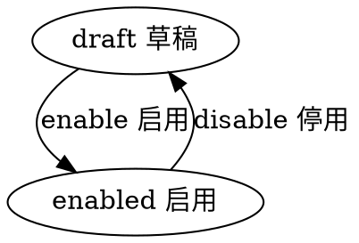

# 目录
---
[TOC]

## 实体 banner
---
$$entity
name]:横幅广告
code]:banner
acl_read]:public
acl_write]:currentuser,admin
propertylist]:
code | name | type | option
--- | --- | --- | ---
code | 编码 | String |  required:[true, 'code required'] & unique:true & lowercase:true
name | 名称 | String |  
desc | 描述 | String |  
space | 广告位 | String |enum:['home_special', 'home_banner','home_all'] & default : 'home_special' & lowercase:true
type | 类型 | String | enum:['native_booklist', 'h5_adv'] & default : 'native_booklist' & lowercase:true
cover | 专题封面 | Image |  
topImage | 首图 | Image |
booklist | 书目 | List<String> |
redirectUrl |跳转H5地址 | String |
state | 状态 | Enum_State | 
createdby | 创建人 | Ref__User | 
createdby_name | 创建人 | String | 
updatedby | 修改人 | Ref__User | 
updatedby_name | 修改人 | String | 

#生命周期
----
##状态机
statemachine]:

