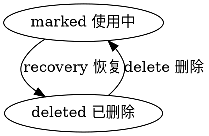

#目录:
----
[TOC]
#实体_mark
----
$$entity
name]:标记
code]:mark
acl_read]:currentuser,admin,bd
acl_write]:currentuser,admin
propertylist]:
code | name | type | option
--- | --- | --- | ---
type | 类型 | String |  enum:['color', 'followed','commet','star'] & default : 'star' & lowercase:true
data | 值 | Object
name | 名称 | String |  |
user | 用户 | ref__user
user_name | 用户名称 | String 
source_id | 来源实体ID | String |  |
source_name | 来源实体名称 | String |  | 
source_type | 来源实体类型 | String |  | 
state | 状态 | Enum_State | 
createdby | 创建人 | Ref__User | 
createdby_name | 创建人 | String | 
updatedby | 修改人 | Ref__User | 
updatedby_name | 修改人 | String | 

#标记类型 mark_type
- color 颜色
- commet 备注
- followed 关注
- star 赞

#生命周期
----
##状态机
statemachine]:

