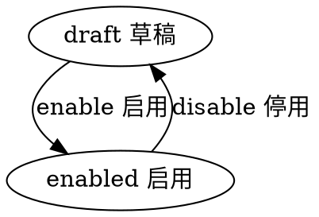

# 目录
---
[TOC]

## 实体 menu
---
$$entity
name]:字典
code]:menu
acl_read]:public
acl_write]:currentuser,admin
propertylist]:
code | name | type | option
--- | --- | --- | ---
name | 名称 | String |  
role | 角色 | List<String> | 
grouplist | 图标项 | List<group> |  
state | 状态 | Enum_State | 
createdby | 创建人 | Ref__User | 
createdby_name | 创建人 | String | 
updatedby | 修改人 | Ref__User | 
updatedby_name | 修改人 | String | 

#生命周期
----
##状态机
statemachine]:

## 一级菜单（分组）
$$sub
name]:一级菜单（分组）
code]:group
propertylist]:
code | name | type | option
--- | --- | --- | ---
name | 类型 | String | required : true
icontype | 图标类型 | String
iconurl | 图标地址 | File
url | 路由 | String
itemlist | 菜单项 | List<item>

## 二级菜单
$$sub
name]:二级菜单
code]:item
propertylist]:
code | name | type | option
--- | --- | --- | ---
name | 类型 | String
icontype | 图标类型 | String
iconurl | 图标地址 | File
url | 路由 | String