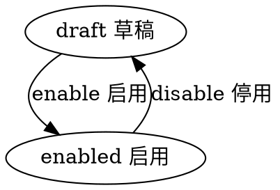

#目录:
----
[TOC]
##实体]:message 消息
----
$$entity
name]:消息
denyfun]:remove|list
code]:message
acl_read]:currentuser
acl_write]:currentuser,admin
propertylist]:
code | name | type | option
-- | -- | --- | --- | --- | ---
title | 标题 | String
content | 内容 | Html
source_id | 来源实体ID | String
source_name | 来源实体 名称 | String
source_type | 来源实体类型 | String
receiver | 接收者 | Ref__User |  |
receiver_name | 接收者名称 | String |  |
state | 状态 | Enum_State | 
createdby | 创建人 | Ref__User | 
createdby_name | 创建人 | String | 
updatedby | 修改人 | Ref__User | 
updatedby_name | 修改人 | String |  

##状态机
statemachine]:

