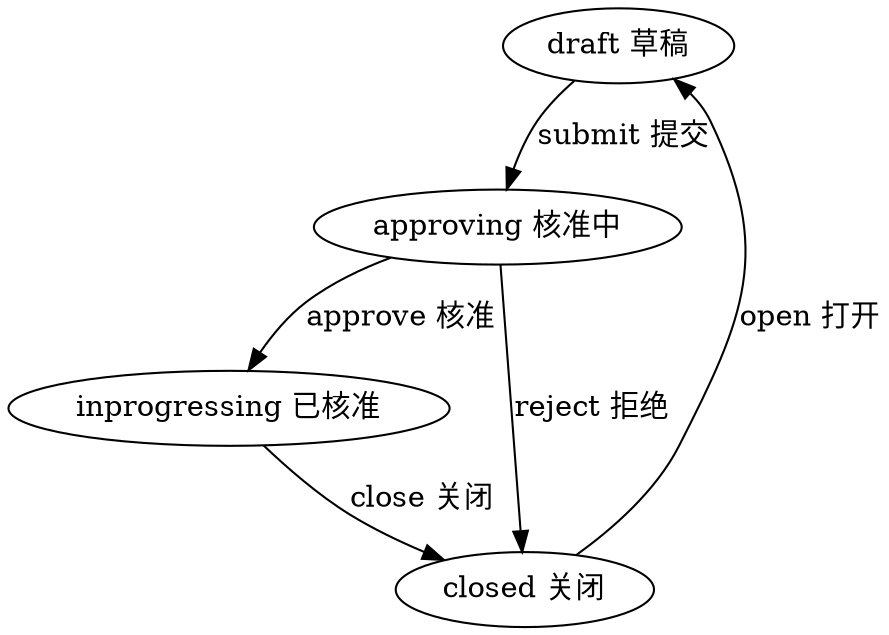

# 目录
---
[TOC]

## 实体 org
---
$$entity
name]:组织
code]:org
acl_read]:public
acl_write]:currentuser,admin
propertylist]:
code | name | type | option
--- | --- | --- | ---
code | 编码 |String |index:true 
name | 名称 | String |  
logo | 图标 | Image | 
approveid | 审批流程id | String |  
tel | 电话 | String
state | 状态 | Enum_State | 
createdby | 创建人 | Ref__User | 
createdby_name | 创建人 | String | 
updatedby | 修改人 | Ref__User | 
updatedby_name | 修改人 | String | 

#生命周期
----
##状态机
statemachine]:

```