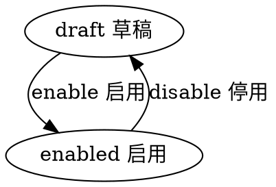

# 目录
---
[TOC]

## 实体 server
---
$$entity
name]:服务器
code]:server
acl_read]:public
acl_write]:currentuser,admin
propertylist]:
code | name | type | option
--- | --- | --- | ---
code | 编码 | String | required:[true, 'code required'] & lowercase:true
name | 名称 | String |  
url | 地址 | String | 
state | 状态 | Enum_State | 
createdby | 创建人 | Ref__User | 
createdby_name | 创建人 | String | 
updatedby | 修改人 | Ref__User | 
updatedby_name | 修改人 | String | 

#生命周期
----
##状态机
statemachine]:

