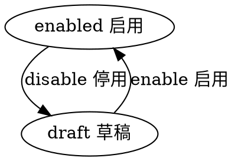

#目录:
----
[TOC]
#实体user
----
$$entity
name]:用户
code]:user
acl_read]:currentuser,admin
acl_write]:currentuser,admin
propertylist]:
code | name | type | option
--- | --- | --- | --- | --- | ---
phone | 手机号 | String |  |
openid| 微信openid | String |
unionid | 微信唯一id | String |  |
email | Email | String |
avatar | 头像 | Image |  | 
province | 省份 | String |  | 
city | 城市 | String |  | 
code | 编码 | String  | required:[true, 'code required'] & lowercase:true
name | 昵称 | String |  |
state | 状态 | Enum_State |
password | 密码 | String
reg_ip | 注册时IP | String
createdby | 创建人 | Ref__User |
createdby_name | 创建人 | String | 
updatedby | 修改人 | Ref__User |
updatedby_name | 修改人 | String |  

##状态机
----
statemachine]:
