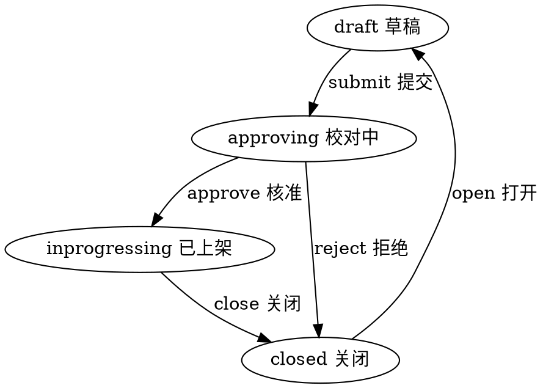

#目录:
----
[TOC]
#实体_book
----
$$entity
name]:图书
code]:book
acl_read]:public
acl_write]:admin,teacher
archive]:365d
propertylist]:
code | name | type | option
--- | --- | --- | --- 
code | 编码 | String| required:[true, 'code required'] & lowercase:true
ver | 版本 | Int |  required: [true, 'code required'] & default:0 
name | 名称 | String | index:true 
name_cn | 名称译文 | String
user | 用户 | Ref__User | index:true
parentBook | 父节点 | Ref_Book | 
cover | 首图 | Image | 
desc | 描述 | String |
grade_from | 年级 | Int | 
grade_to | 到年级 | Int | 
level_from | 级别 | Int | 
level_to | 到级别 | Int | 
series | 系列 | String | 
topiclist | 话题 | List<String>
type | 书类型 | Enum_Booktype | enum:['en', 'cn','entext','cntext']  & lowercase:true & index:true 
pagelist | 单元 | List<bookpage>
page_count | 单元数 | Int | min:0 
section_count | 页数 | Int | min:0
wordlist | 关键词 | List<bookword>
actorlist | 角色| List<bookactor>
keyword_count | 关键词数 | Int | min:0
word_count | 单词数 | Int | min:0
quizlist | 练习 | List<bookquiz>
quiz_count | 题数量 | Int | min:0
state | 状态 | Enum_State | index:true 
createdby | 创建人 | Ref__User | 
createdby_name | 创建人 | String |
updatedby | 修改人 | Ref__User | 
updatedby_name | 修改人 | String |  

#生命周期
----
##状态机
statemachine]:

## 角色
$$sub
name]:角色
code]:bookactor
propertylist]:
code | name | type | option
--- | --- | --- | ---
name| 名称 | String
avatar | 头像 | Image

## 测验
$$sub
name]:测验
code]:bookquiz
propertylist]:
code | name | type | option
--- | --- | --- | ---
type | 类型 | Enum_QuizType
question | 题干 | String
options | 选项 | List<String>
options_cn | 选项译文 | List<String>
options_audio |选项读音| List<File>
options_image |选项图片| List<Image>
audio | 音频 | File
question_cn | 题干中文 | String
image | 图片 | Image
answer | 答案 | String

## 单词
$$sub
name]:单词
code]:bookword
propertylist]:
code | name | type | option
--- | --- | --- | ---
word | 文本 | String
word_cn | 译文 | String
audio | 音频 | File
image | 图片 | Image

## 页面（单元）
$$sub
name]:页面
code]:bookpage
propertylist]:
code | name | type | option
--- | --- | --- | ---
contentImage | 图片 | Image
sectionlist | 节 | List<bookpage_pageSection>
audio | 音频 | File

## 节（句子）
$$sub
name]:节
code]:bookpage_pageSection
propertylist]:
code | name | type | option
--- | --- | --- | ---
fontsize | 字体大小 | Int
align | 对齐 | Enum_AlignType | enum:['left', 'right','center'] & default:'left'  & lowercase:true
text | 文本 | String
text_cn | 译文 | String
lrc | 歌词 | List<bookpage_pageSectionWord>
audio | 音频 | File
actor | 角色名称 | String

## 歌词
$$sub
name]:歌词
code]:bookpage_pageSectionWord
propertylist]:
code | name | type | option
--- | --- | --- | ---
word | 单词 | String
phonetic | 读音 | String
start | 开始时间 | Int
end | 结束时间 | Int

##Book_Type
- 1 en 英文绘本 default
- 2 cn 中文绘本
- 3 enText 英文课本（文本）
- 4 cnText 中文课本
- 5 audio 音频
- 6 video 视频

