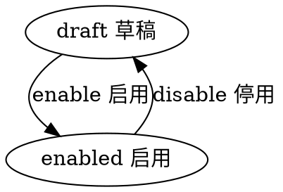

#目录:
----
[TOC]
#实体_series
----
$$entity
name]:系列
code]:series
acl]:publicread_privatewrite
propertylist]:
code | name | type | option
--- | --- | --- | ---
name | 名称 | String |
shortname | 简称 | String |
avatar | 首图 | Image |
avatar_ex1 | 图片 | Image
avatar_ex2 | 图片 | Image
parentid | 父节点 | String |
grade_from | 年级 | Int |
grade_to | 年级 | Int |
level_from | 级别 | Int |
level_to | 到级别 | Int |
desc | 描述 | String
fullname | 全称 | String
bookcount | 书总数 | Int
state | 状态 | Enum_State |
createdby | 创建人 | Ref__User |
createdby_name | 创建人 | String |
updatedby | 修改人 | Ref__User |
updatedby_name | 修改人 | String | 

#生命周期
----
##状态机
statemachine]:

