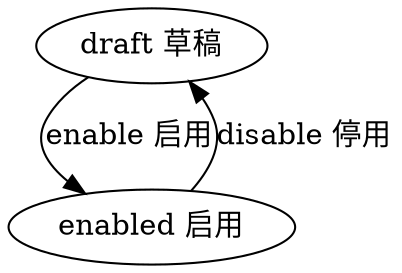

# 目录
---
[TOC]

## 实体 topic
---
$$entity
name]:话题
code]:topic
acl]:private
propertylist]:
code | name | type | option
--- | --- | --- | --- | --- | ---
name | 名称 | String |  |
desc | 描述 | String
shortname | 简称 | String
parentid | 父节点 | String |  | 
index | 排序 | Int
avatar | 首图 | Image |  | 
state | 状态 | Enum_State |
createdby | 创建人 | Ref__User |
createdby_name | 创建人 | String | 
updatedby | 修改人 | Ref__User |
updatedby_name | 修改人 | String |  

#生命周期
----
##状态机
statemachine]:
