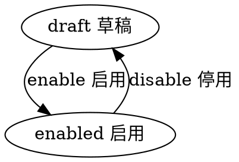

# 目录
---
[TOC]

## 实体 word
---
$$entity
name]:词典
code]:word
acl]:private
propertylist]:
code | name | type | option
--- | --- | --- | --- | --- | ---
text | 文本 | String |  |
text_lower | 小写文本 | String
meaninglist | 解释 | List<String>
from | 来源 | String
avatar | 图片 | Image
phonetic | 音标 | String
phonetic2 | 音标2 | String
audio | 读音 | File
audio2 | 读音2 | File
lang | 语言 | String |  | 
state | 状态 | Enum_State |
createdby | 创建人 | Ref__User |
createdby_name | 创建人 | String | 
updatedby | 修改人 | Ref__User |
updatedby_name | 修改人 | String |  

#生命周期
----
##状态机
statemachine]:
