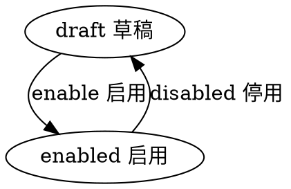

#目录:
----
[TOC]
#实体_area
----
$$entity
name]:省市区
code]:area
acl_read]:public
acl_write]:currentuser,admin,bd
propertylist]:
code | name | type | option
--- | --- | --- | ---
name | 名称 | String |
schoolcount | 学校数量 | Int
levelflag | 省市区标识 | String | enum:['province', 'city','region'] & default : 'region' & lowercase:true
state | 状态 | Enum_State |
createdby | 创建人 | Ref__User |
createdby_name | 创建人 | String |
updatedby | 修改人 | Ref__User |
updatedby_name | 修改人 | String |
 
#生命周期
----
##状态机
statemachine]:

