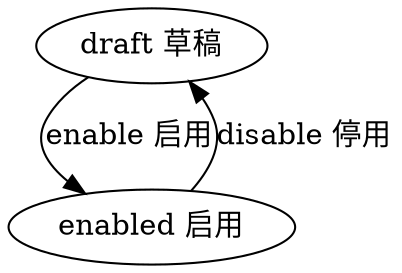

#目录:
----
[TOC]
#实体_student
----
$$entity
name]:学生
code]:student
acl]:publicread_privatewrite
propertylist]:
code | name | type | option
--- | --- | --- | ---
name | 名称 | String |
code | 编码 | String
age | 年龄 | Int |
sex | 性别 | Int |
startyear | 入学时间 | Datetime
birthday | 生日 | Datetime
school | 学校 | Ref_School |
school_name | 学校名称 | String |
grade | 年级 | Int |
level_from | 级别 | Int |
level_to | 到级别 | Int |
teacher | 老师 | Ref_Teacher
teacher_name | 老师名称 | String
teacher_class_name | 班级名称 | String
teacher_class_group | 班级分组 | String
teacher2 | 老师 | Ref_Teacher
teacher2_name | 老师名称 | String
teacher2_class_name | 班级名称 | String
teacher2_class_group | 班级分组 | String
avatar | 头像 | Image
user | 用户 | Ref_User
parent | 家长 | Ref_User
state | 状态 | Enum_State |
createdby | 创建人 | Ref__User |
createdby_name | 创建人 | String | 
updatedby | 修改人 | Ref__User |
updatedby_name | 修改人 | String |  
 
 

#生命周期
----
##状态机
statemachine]:

