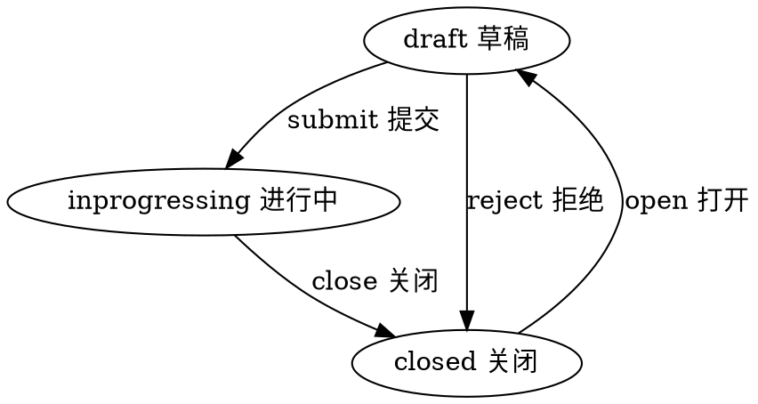

#目录:
----
[TOC]
#实体_task
----
$$entity
name]:任务
code]:task
acl]:privateread_privatewrite
propertylist]:
code | name | type | option
--- | --- | --- | ---
work | 作业 | Ref_work
work_start | 开始时间 | Datetime |
work_end | 结束时间 | Datetime
work_book | 书 | Ref_Book
work_book_type | 书类型 | Enum_Booktype
work_book_name | 书 | String
work_book_avatar | 首图 | Image
work_teacher | 老师 | Ref_Teacher
work_teacher_name | 老师名称 | String
student | 学生 | Ref_Student
student_name | 学生 | String
state | 状态 | Enum_State |
createdby | 创建人 | Ref__User |
createdby_name | 创建人 | String | 
updatedby | 修改人 | Ref__User |
updatedby_name | 修改人 | String |  
 
 

#生命周期
----
##状态机
statemachine]:

