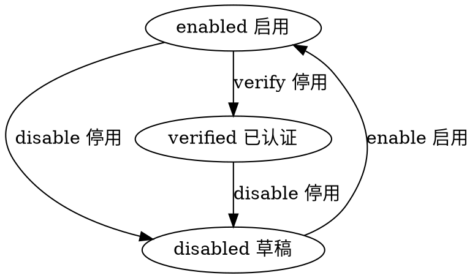

#目录:
----
[TOC]
#实体_teacher
----
$$entity
name]:老师
code]:teacher
acl]:publicread_privatewrite
propertylist]:
code | name | type | option
--- | --- | --- | ---
name | 名称 | String |
code | 编码 | String
age | 年龄 | Int |
sex | 性别 | Int |
type | 类型 | Enum_Type
birthday | 生日 | Datetime
classlist | 班级 | List<classinfo>
school | 学校 | Ref_School |
school_name | 学校名称 | String |
level_from | 级别 | Int |
level_to | 到级别 | Int |
avatar | 头像 | Image
user | 用户 | Ref_User
state | 状态 | Enum_State |
createdby | 创建人 | Ref__User |
createdby_name | 创建人 | String | 
updatedby | 修改人 | Ref__User |
updatedby_name | 修改人 | String |  

## Enum_Type
- 1 语文
- 0 英语 default

#生命周期
----
##状态机
statemachine]:

## classinfo
$$sub
name]:班级信息
code]:classinfo
propertylist]:
code | name | type | option
--- | --- | --- | ---
100 | name | 名称 | String |
120 | code | 编码 | String |
180 | grade | 年级 | Int |
180 | level_from | 级别 | Int |
190 | level_to | 到级别 | Int |
200 | verfiy_type | 入班验证 | Int
220 | group1_name | 组1名称 | String
230 | group2_name | 组2名称 | String
250 | group3_name | 组3名称 | String
260 | group4_name | 组4名称 | String
270 | group5_name | 组5名称 | String
