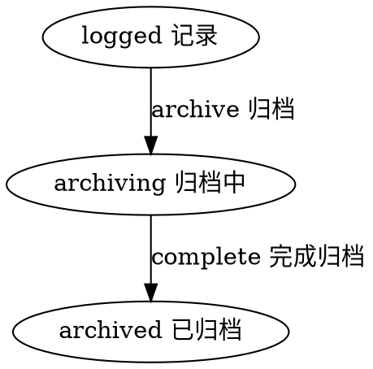

#目录:
----
[TOC]
#实体_trace
----
$$entity
name]:学习记录
code]:trace
archive]:365d
acl]:publicread_privatewrite
propertylist]:
code | name | type | option
--- | --- | --- | ---
user | 用户 | Ref__User |
user_name | 用户名称 | String  | 
operator | 操作| String
operatedat | 操作时间 | Datetime
content |内容|String
source_id | 来源实体ID | String |  |
source_key | 单号 |String
source_name | 来源实体名称 | String |  | 
source_type | 来源实体类型 | String |  | 
state | 状态 | Enum_State |
createdby | 创建人 | Ref__User | 
createdby_name | 创建人 | String | 

#生命周期
----
##状态机
statemachine]:

