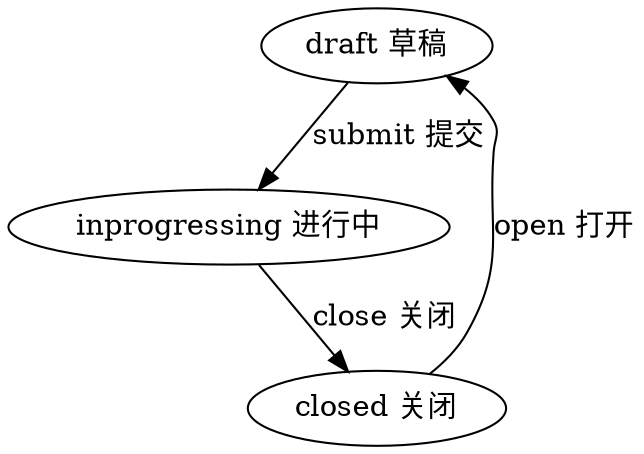

#目录:
----
[TOC]
#实体_work
----
$$entity
name]:作业
code]:work
acl]:publicread_privatewrite
propertylist]:
code | name | type | option
--- | --- | --- | ---
start | 开始时间 | Datetime |
end | 结束时间 | Datetime
daycount | 计划天数 | Int |
classlist | 班级 | List<classinfo> |
book | 书 | Ref_Book 
book_type | 书类型 | Enum_Booktype
book_name | 书名称 | String 
teacher | 老师 | Ref_Teacher
teacher_name | 老师名称 | String
user | 用户 | Ref_User
state | 状态 | Enum_State |
createdby | 创建人 | Ref__User |
createdby_name | 创建人 | String | 
updatedby | 修改人 | Ref__User |
updatedby_name | 修改人 | String |  
 
#生命周期
----
##状态机
statemachine]:

## classinfo
$$sub
name]:班级信息
code]:classinfo
propertylist]:
code | name | type | option
--- | --- | --- | ---
100 | name | 名称 | String |
120 | code | 编码 | String |
180 | grade | 年级 | Int |
180 | level_from | 级别 | Int |
190 | level_to | 到级别 | Int |
200 | verfiy_type | 入班验证 | Int
220 | group1_name | 组1名称 | String
230 | group2_name | 组2名称 | String
250 | group3_name | 组3名称 | String
260 | group4_name | 组4名称 | String
270 | group5_name | 组5名称 | String
